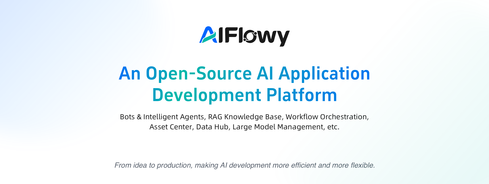

Here is the English translation of your document:




# AIFlowy: Enterprise-Grade AI Agent Development Platform


AIFlowy is an **enterprise-grade, open-source AI application (agent) development platform** built with Java, designed to empower developers and organizations with an **efficient, open, and locally adaptable** AI toolchain and low-barrier capabilities for deploying AI solutions.

While AIFlowy competes with mainstream platforms such as Coze, and Dify, it distinguishes itself through a **strong focus on real-world enterprise needs and regulatory considerations**—reflected in its architecture, feature set, and scenario-driven design. AIFlowy supports the full lifecycle of AI applications, from bot creation and RAG knowledge bases to AI workflow orchestration and model management.


## ✨ Core Features

### 🧠 AI Capabilities
- ✅ Intelligent Bot Creation & Publishing
- ✅ Plugin System (supports custom tool integration)
- ✅ RAG Knowledge Base (supports document upload, parsing, and retrieval)
- ✅ AI Workflow Orchestration (visual workflow editor with conditions, branches, and loops)
- ✅ Media Center (AI-generated images, audio, video, etc.)
- ✅ Data Hub (custom data tables with workflow read/write capabilities)
- ✅ Multi-Model Management (unified integration of mainstream LLMs)
- ✅ MCP (Model Context Protocol) integration, execution, and auto-invocation

### 🔐 System Management
- ✅ User / Role / Department / Position / Permission System
- ✅ Menu & System Configuration
- ✅ Access Tokens (API Keys)
- ✅ Scheduled Tasks & Operation Logs
- ✅ User Feedback & UI Customization
- ✅ Authentication Configuration (supports multiple login strategies)

### 🔜 Upcoming Roadmap
- [ ] Enhanced RAG retrieval accuracy and multimodal support
- [ ] Improved frontend interaction experience and performance
- [ ] Comprehensive developer documentation and SDK ecosystem


## Tech Stack
- **Backend**: JDK 17 + Spring Boot v3 + Agents-Flex + MyBatis-Flex + Redis + Quartz
- **Frontend**: Vue 3 + pnpm + Element Plus + Vue Router


## Admin Console Screenshots

| Module               | Screenshot |
|----------------------|------------|
| Login Page           |  |
| Bot Configuration    |  |
| Plugin Center        |  |
| Workflow Orchestration |  |
| Knowledge Base       |  |
| Media Center         |  |
| LLM Management       |  |


## User Center Screenshots

| Module              | Screenshot |
|---------------------|------------|
| Login Page          |  |
| Chat                |  |
| App Marketplace     |  |
| App Details         |  |
| AI Agent            |  |
| Agent Execution Log |  |


## 🚀 Quick Start

```bash
# Clone the repository
git clone https://gitee.com/aiflowy/aiflowy.git  
cd aiflowy

# Build the backend
mvn clean package

# Start the frontend (Vue + pnpm)
cd aiflowy-ui-admin
pnpm install
pnpm dev
```

> Default credentials: `admin` / `123456`  
> 📚 **Detailed deployment & development guide**: [https://aiflowy.tech/zh/development/getting-started/getting-started.html](https://aiflowy.tech/zh/development/getting-started/getting-started.html)


## 📚 Documentation Center

Full product and development documentation is available at:  
👉 [https://aiflowy.tech](https://aiflowy.tech)


## 🏢 About Us

AIFlowy is developed by a team deeply experienced in AI engineering and the Java ecosystem. Prior to AIFlowy, we’ve successfully open-sourced several widely recognized community projects:

- **[Agents-Flex](https://gitee.com/agents-flex/agents-flex)**: Lightweight Java AI Agent framework
- **[Tinyflow](https://gitee.com/tinyflow-ai/tinyflow)**: Low-code AI workflow engine
- **[AIEditor](https://gitee.com/aieditor-team/aieditor)**: Open-source AI content editor

These projects are widely used in enterprise production environments and have been awarded **Gitee GVP (Gitee Most Valuable Open Source Project)**, reflecting our strong technical foundation and engineering capabilities in AI infrastructure.


## ⚖️ License and Usage Terms

AIFlowy is released under the **Apache License 2.0**, with the following **additional brand usage terms**:

> 1. You **must not remove, alter, or obscure** any logos, copyright notices, brand identifiers, or console attributions in the product.
> 2. All derivative or redistributed versions **must fully retain** the original copyright notice, LICENSE file, and these additional terms.
> 3. **Commercial use is permitted** (including internal enterprise use, product integration, SaaS offerings, etc.), provided the above terms and applicable laws are followed.
>
> ⚠️ **Important Notice**:  
> Any use of AIFlowy (including downloading, deploying, modifying, or distributing) constitutes your **full understanding and acceptance** of this license and its附加条款. If you do not agree, please immediately cease use and delete all related materials.

We strongly support the open-source spirit while also **respecting and protecting the project’s brand and the developers’ efforts**. We reserve the right to pursue legal action against malicious de-branding, unauthorized branding, or license violations.
