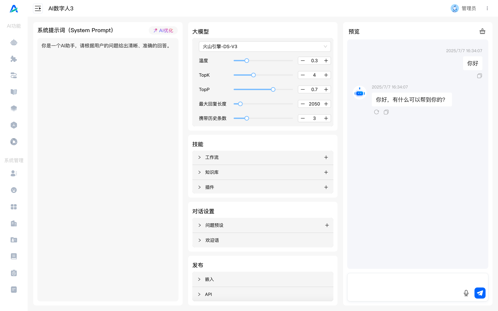
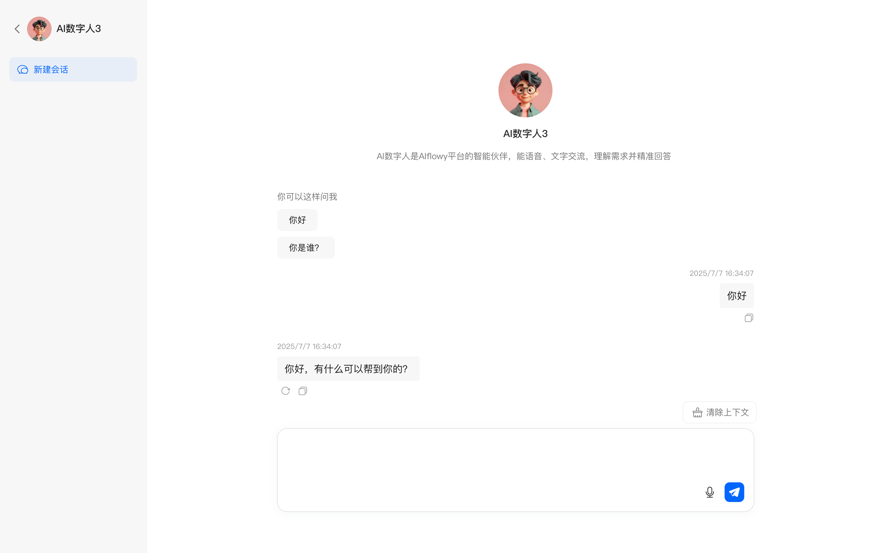
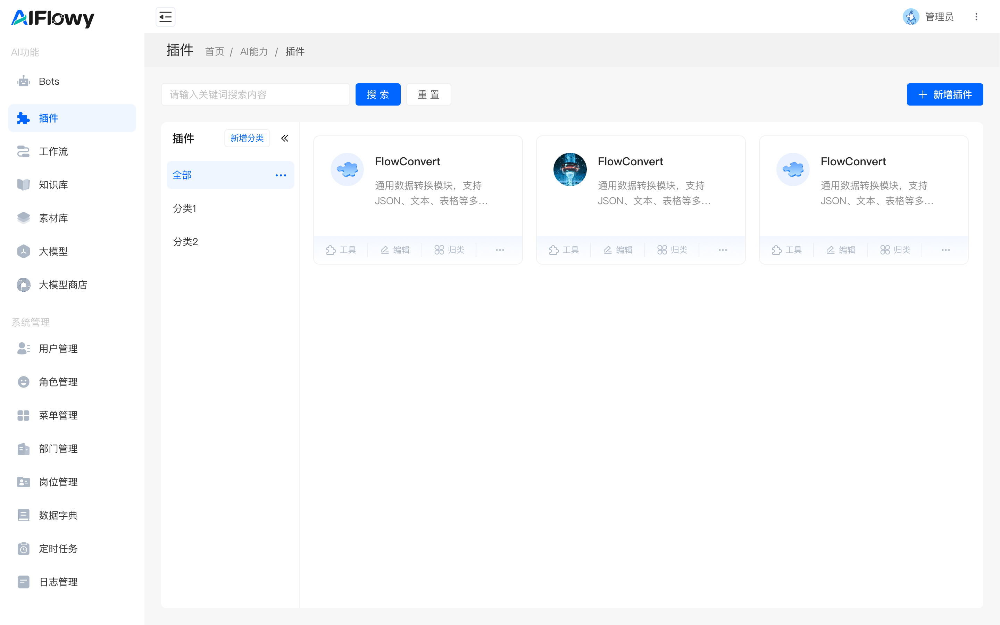
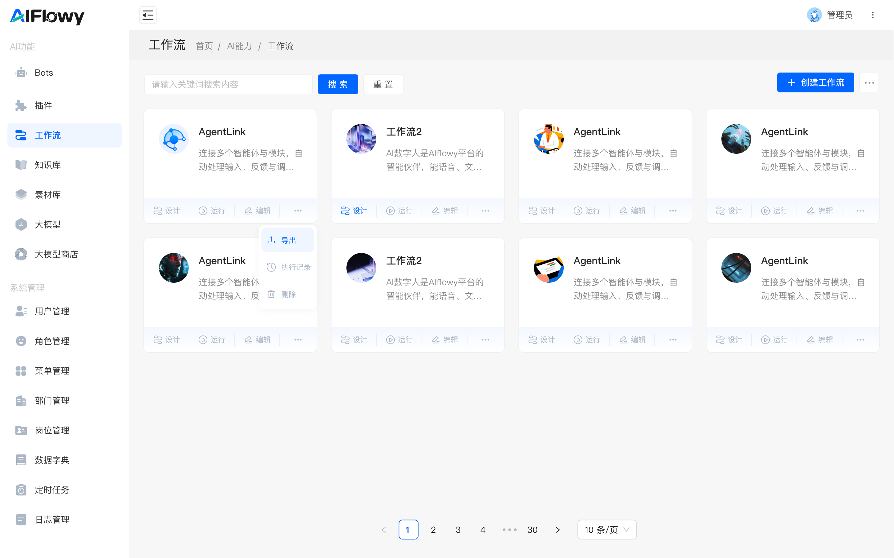
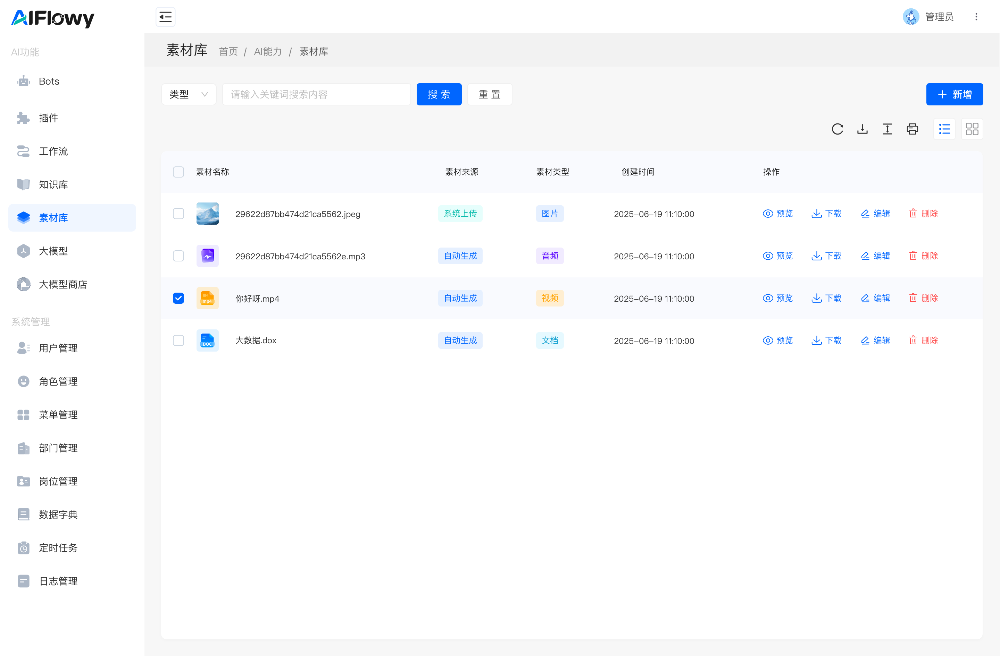
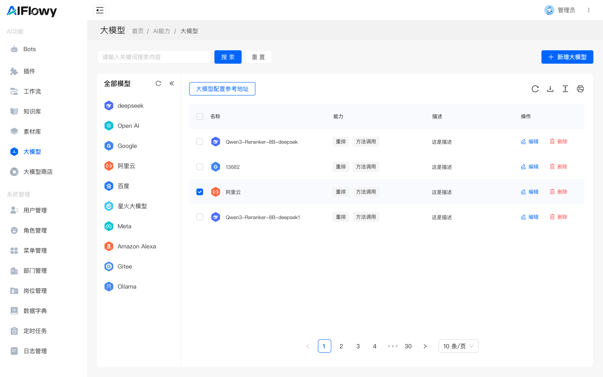

# AIFlowy： 一个 AI 产品的底座和基石

AIFlowy 是一个基于 Java 开发的企业级的开源 AI 应用开发平台 ，致力于为中国开发者和企业提供高效、开放、本土化的 AI 工具与能力。我们对标字节 Coze、腾讯元器和 Dify 等产品，但更加聚焦于中国环境下的 toB 场景深度应用与落地实践。

## 通知

🚀 AIFlowy v2.0 正在开发中...

你期待哪些新特性？

- 支持 MCP 协议？
- 更强大的 RAG 能力？
- 采用 Vue 重构前端？
- 内置完整可观测性（Observability）？
- 新增多种智能体协作模式？
- 全面提升系统性能与扩展性？

💡 现在就为 AIFlowy 投上一票，直接影响 v2.0 的开发方向！

🔗 投票地址：https://gitee.com/activity/2025opensource?ident=INV9BE

**PS：投票后，截图私聊作者微信：fuh99777，拉你进入 AIFlowy v2.0 专有交流群，抢先参与功能设计与讨论！**

注意：当前 main 分支为开发版本，稳定版本请切换到 v1.x 分支。

## 功能列表

**AI 功能**
- [x] Bots 应用
- [x] 业务插件
- [x] RAG 知识库
- [x] Workflow 智能体编排（AI 工作流）
- [x] 素材中心（AI 自动生成图片、音频、视频等素材内容）
- [x] 数据中枢（自定义表，以及工作流读取和存储）
- [x] 本地模型
- [x] 模型管理

**系统管理**
- [x] 用户管理
- [x] 角色管理
- [x] 菜单管理
- [x] 部门管理
- [x] 岗位管理
- [x] 日志管理
- [x] 数据字典
- [x] 定时任务

**近期计划**
- [ ] 持续完善文档（进行中...）
- [ ] 增强稳定性（进行中...）
- [ ] 优化用户体验（进行中...）

## 产品截图


登录


Bots


Bots


插件


工作流


知识库


素材库


大模型


## 快速开始

```shell
git clone https://gitee.com/aiflowy/aiflowy.git

cd aiflowy
mvn clean package

cd aiflowy-ui-react
npm install
npm run dev

默认用户名密码：
admin/123456
```

详细文档请参考： https://aiflowy.tech/zh/development/getting-started/getting-started.html


## 开发及产品文档

https://aiflowy.tech


## Star 用户专属交流群


Star 本项目后，截图发给微信： fuh99777，拉您进群，讨论 AIFlowy 技术以及场景落地等话题。


## 关于团队
我们是一支精干高效、充满激情与创造力的团队。在推出 AIFlowy 之前，我们已经成功打造了多个备受认可的开源项目， 包括 Agents-Flex 、Tinyflow 和 AIEditor 。

- Agents-Flex： https://gitee.com/agents-flex/agents-flex （对标 LangChain）
- Tinyflow：https://gitee.com/tinyflow-ai/tinyflow
- AIEditor：https://gitee.com/aieditor-team/aieditor


这些项目产品，不仅成为了 AI 技术社区中的基石工具， 更荣幸地被评选为 GVP 项目，也展现了我们在人工智能领域的踏实积累和创新能力。

### 愿景 Vision

>成为中国最具有影响力的人工智能品牌之一，引领核心技术自主创新，推动中国 AI 技术生态繁荣发展和科技自立。

### 使命 Mission

>为中国开发者、政企用户，提供高效、开放、本土化的 AI 开发工具与解决方案，降低技术门槛，加速人工智能在产业中的深度应用。


### 价值观 Values

> **“专注务实”**
>
> 坚持聚焦核心方向，深耕垂直场景，打造极致产品体验，持续打磨每一个细节。

> **“自主创新”**
>
> 立足中国 AI 生态，以自主可控为目标，持续探索前沿技术，构建国产化 AI 工具链。

> **“开放共享”**
>
> 秉承开源精神，积极参与开发者社区共建，推动知识传播与技术普惠。

> **“责任担当”**
>
> 以技术理想为引领，坚持长期主义，用专业与行动践行对行业与社会的责任。


**请注意：**
> AIFlowy 采用 Apache License 2.0 开源协议发布，并附加以下使用条件：
>
> - 未经许可，不得删除、修改或隐藏产品中的 LOGO、版权信息、品牌标识及控制台中的署名或归属信息；
> - 所有衍生版本或分发版本必须完整保留原始版权声明、许可文件及本附加条款；
>
> 在遵守《Apache License 2.0》条款、本附加条件以及相关国家法律法规的前提下，允许用于商业用途，包括但不限于企业内部使用、产品集成、服务提供等。
>
> **特别提示：**
>
> 您对 AIFlowy 的任何使用行为（包括但不限于下载、安装、部署、修改或分发），即视为您已充分阅读、理解并无条件接受本许可协议及其附加条款。若您不同意上述内容，请立即停止使用，并彻底删除已获取的代码、文档及相关资源。
>
> 我们致力于推动开源生态的发展，同时也尊重并保护项目品牌与开发者劳动成果，感谢您的理解与支持。对于恶意篡改、去标识化或冒用品牌的行为，我们将通过技术手段和法律途径坚决维权。
