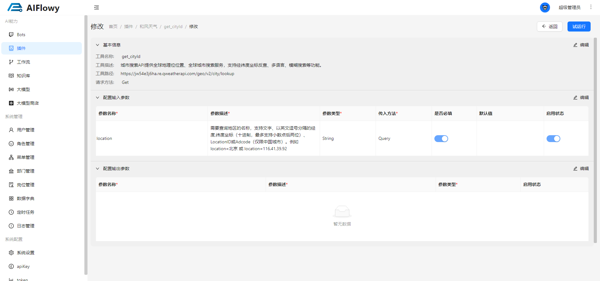
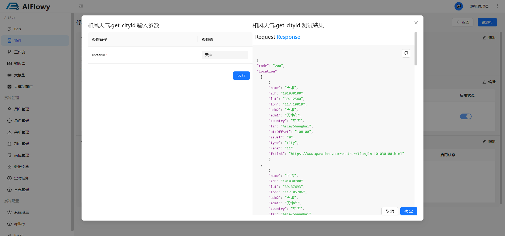

# 挂载插件

挂载插件之前需要创建一个插件，首先点击左侧菜单栏的插件，然后点击 **新增插件** 按钮。 
这里以 [和风天气](https://console.qweather.com/project?lang=zh)  为例，创建一个 **查询城市id** 的插件。

## 1. 创建插件
1. 点击 **创建项目** 按钮， 创建一个新的项目

2. 我这里创建了一个叫 test 的项目

3. 凭据身份认证方式选择 **API KEY**

4. 点击查看创建的 API KEY

5. 拿到 API KEY 

6. 填写插件信息

7. 插件url 获取地址为 [插件url](https://console.qweather.com/setting?lang=zh)

8. 在Headers 添加 X-QW-Api-Key: 你的 API KEY

9. 然后进入已经创建好的这个插件， 进入如图所示页面， 点击**创建工具**按钮

10. 创建好工具之后，点击 **修改**

11. 配置如图所示的参数 
**注意** 这里配置的 默认值 的作用是：当你挂载这个插件到 Bot 的时候，这个默认值不会被大模型返回的值替代，假如你这个参数想让大模型返回的参数来填充
那么默认值就不要设置值

## 2. 插件试运行
1. 插件配置完成后点击右上角的 **试运行** 按钮

2. 输入参数，点击 **运行** 
**注意：** 只有在这里试运行成功之后能正常请求到接口数据，才能挂载到 Bot 中，不然 Bot 调用插件的时候会调用插件失败

## 3. 挂载插件

进入 Bot 详情页面，点击 **插件** 右上角的 **+** 按钮，选择刚才创建好的 插件**get_cityId**，点击 **选择**， 这样就给我们的智能机器人挂上了插件。

## 4. 插件测试
