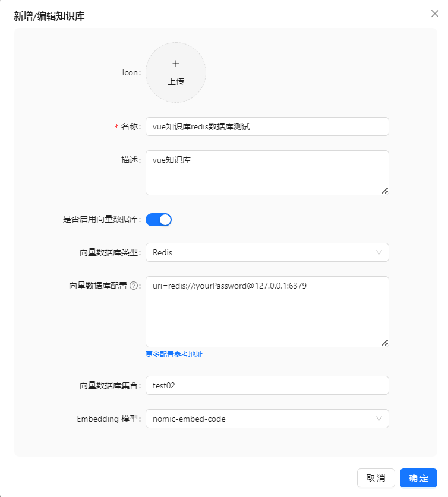
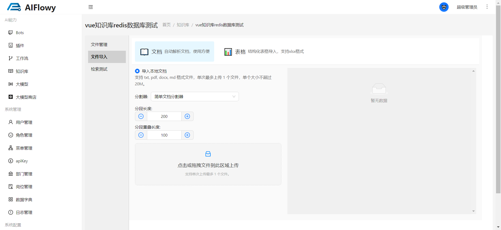
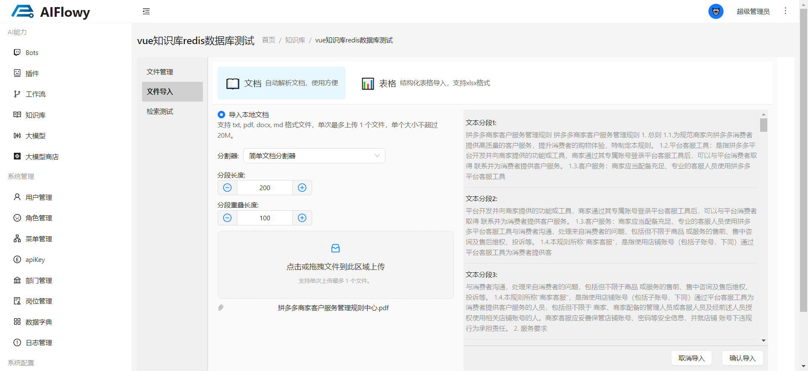
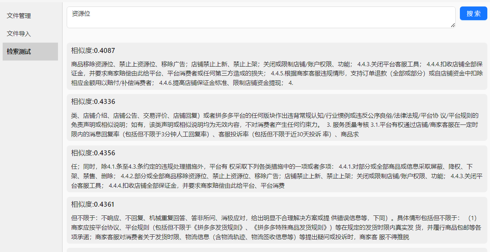

# 如何创建一个知识库

这里以向量数据库 **redis-stack** 为例，创建知识库的时候需要注意以下几点：
1. **知识库名称**：知识库的名称非常重要，所以请确保名称不重复。知识库名称需要让大模型识别，大模型会判断该知识库的名称，从而进行知识库的检索。
2. **知识库描述**：知识库的描述是可选的，但是建议添加描述，方便用户了解知识库的内容。

## 1. 创建向量模型
请参考 [如何创建向量模型](/zh/product/knowledge/embedding)

## 2. 创建知识库

## 3. 向知识库导入文件
1. 进入知识库 **文件导入** 页面

2. 首先选择 **分割器** ，然后设置分割器参数，然后选择 点击 **上传文件**，文件分割成功后会返回分割的效果

3. 返回分割效果后，点击 **确认导入**，等待文件上传到知识库中，会提示 **上传成功**

## 4. 检索测试

