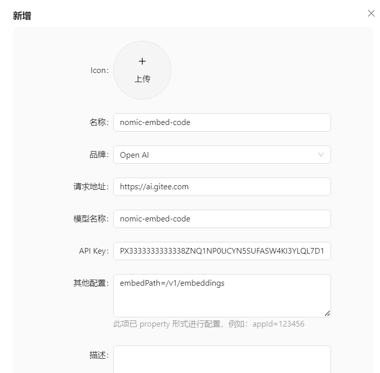
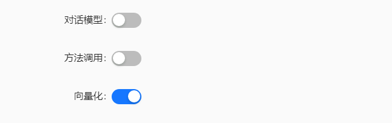

# 向量模型

## 介绍
Embedding 模型处理器是一款基于最先进神经网络的向量化计算引擎，能够将文本、图像等非结构化数据转化为高维向量表示。适用于语义搜索、智能推荐、聚类分析等AI应用场景

如何更好的利用好知识库，向量模型的选择是非常重要的，这里建议使用 [模力方舟](https://ai.gitee.com/) 的向量模型。向量模型支持的维度越高，搜索的准确度越高，但是搜索速度越慢。

## 向量模型配置步骤
1. 点击左侧菜单栏的大模型，点击 **新增** 按钮



2. 如果配置的是知识库的向量模型，记得勾选上 **向量化**, 只有勾选上  **向量化**，向量模型才会生效



**参数说明**：

**名称**：向量模型名称，可以自由填写<br/>
**品牌**：该模型属于哪个品牌的，**注意**：如果使用 Gitee 的模力方舟，则品牌填写为 **Open AI**<br/>
**API Key**: 向量模型的 ApiKey<br/>
**模型名称**：使用的模型名称，必须和官方的模型名称一致

**其他配置（这里用 Gitee 的向量模型作为配置参考，其他配置参考大模型官方要求进行配置）**：
```yml
embedding=/v1/embeddings # 模型向量化地址
```