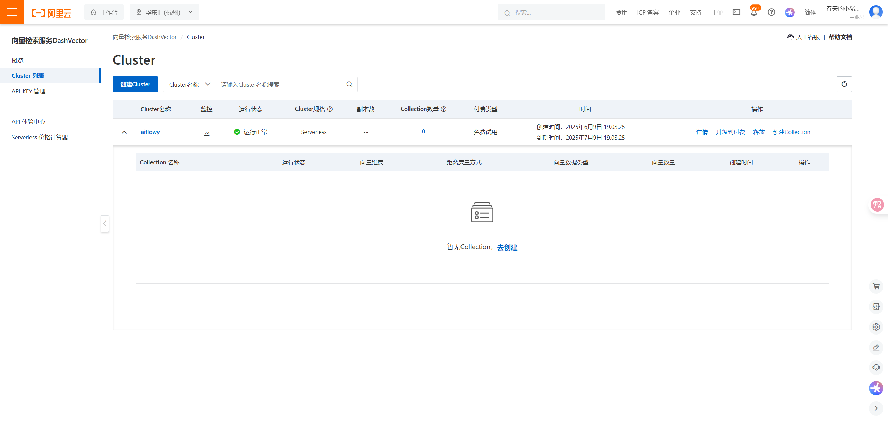
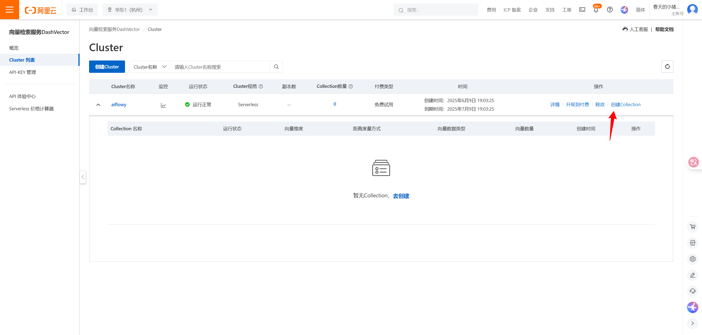
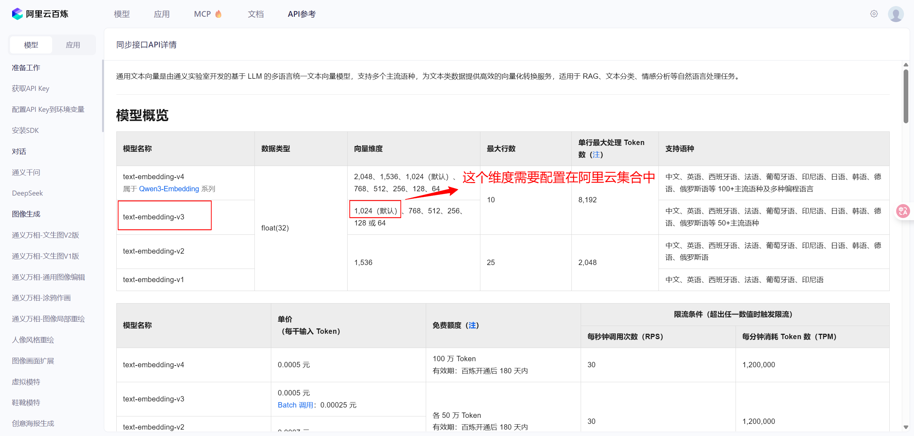
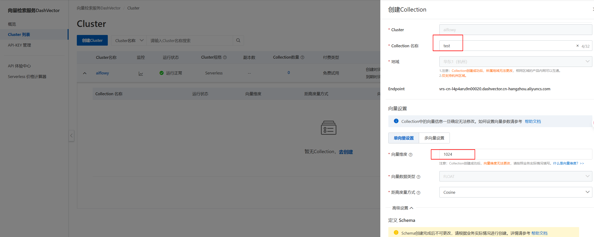
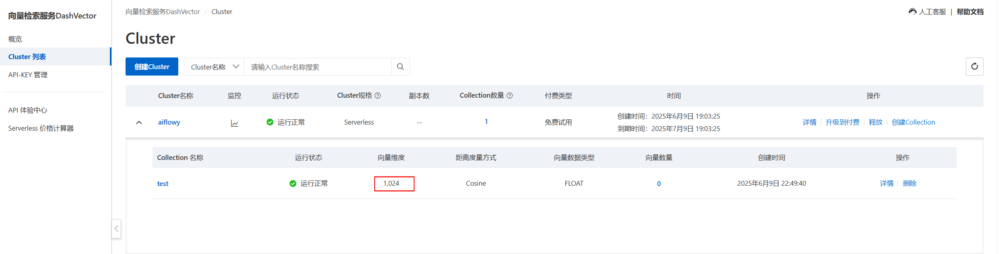
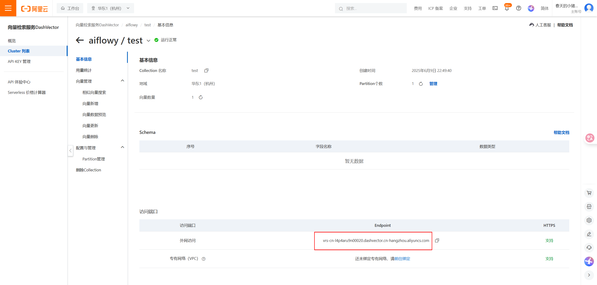
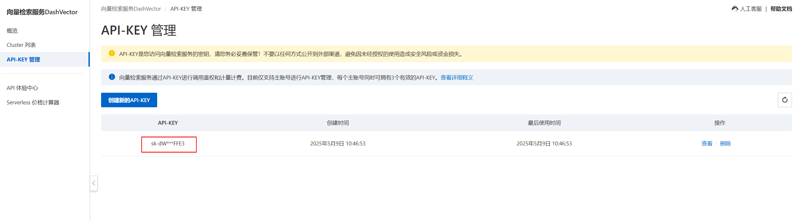
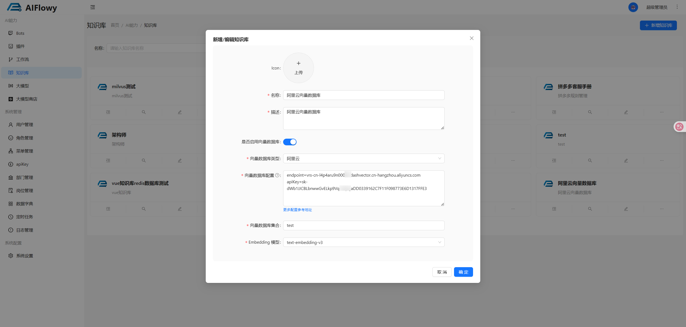
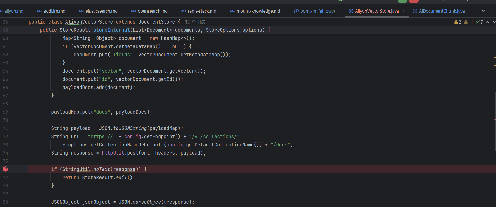

# 阿里云 向量数据库

打开 [阿里云向量向量数据库配置地址](https://dashvector.console.aliyun.com/) 配置相关信息
## 1. 创建 Cluster 

## 2. 创建集合名称
点击 **创建Collection**

配置集合相关信息， 这里我创建了一个名为 test 的集合名称，下图中的向量维度应该怎么填？ 
在这里我们使用 [阿里云向量模型配置地址](https://bailian.console.aliyun.com/?spm=5176.29597918.J_SEsSjsNv72yRuRFS2VknO.2.2fa47b08M1kJNB&tab=api#/api/?type=model&url=https%3A%2F%2Fhelp.aliyun.com%2Fdocument_detail%2F2712515.html) 
打开之后看到如下页面，这里我使用了 **text-embedding-v3** 这个向量模型，咱们可以看到向量模型的向量维度为 1024维

配置好维度和数据库集合名称之后，点击 **确定** 

创建好的集合如下图

## 3. 配置阿里云向量模型
配置模型之前需要获取到创建的这个集合的 Endpoint, 点击下图中的 **详情**

复制下图中的 Endpoint

**这里阿里云的向量模型配置参考如下：** 

endpoint 的值为上图中创建集合时的 Endpoint 
集合名称为刚才创建好的集合名称 test
apiKey 的值获取地址为: [apiKey获取地址](https://dashvector.console.aliyun.com/api-key)

**注意**：**向量数据库集合** 需要先在阿里云上创建，才能配置在 AIFlowy 中

## 4. 配置 AIFlowy 中的知识库

## 5. 接下来就可以去这个知识库中正常导入文件了

## 6. 断点调试
如果未成功存入阿里云向量数据库，可以在这里断点调试，查看 response 返回报错信息是什么

