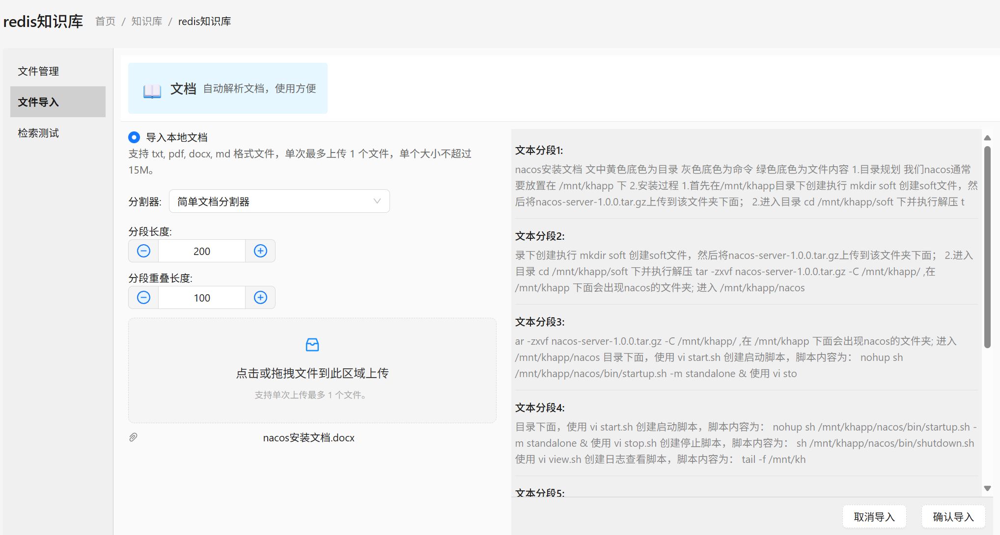
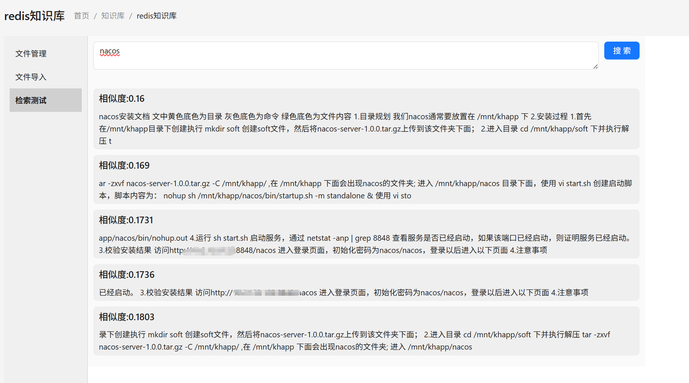

# Redis向量数据库

## 1. 部署Redis向量数据库

Redis 向量数据库是包含 redisSearch 功能组件的 Redis ,这里使用 docker 版实现快速部署

```java
docker run --name  redis_stack  -e REDIS_ARGS="--requirepass Test2025L" -p 6379:6379  -d --restart=always redis/redis-stack-server:latest
```

## 2. 知识库页面配置

向量数据库类型选择 Redis ,向量数据库配置中填写 uri = redis://:Test2025L@127.0.0.1:6379，向量数据库集合中填写知识库英文缩写如：redisKnowledge, Embedding 模型中选择一个模型（大模型菜单中能力是 Embedding 的模型）


扩展：向量数据库配置中还可以增加 storePrefix、defaultCollectionName 等配置，配置了 defaultCollectionName 时新增/编辑知识库页面中的“向量数据库集合”可以为空。

```java
storePrefix = docs:
defaultCollectionName = documents
```
## 3. 文件导入

## 4. 检索测试

